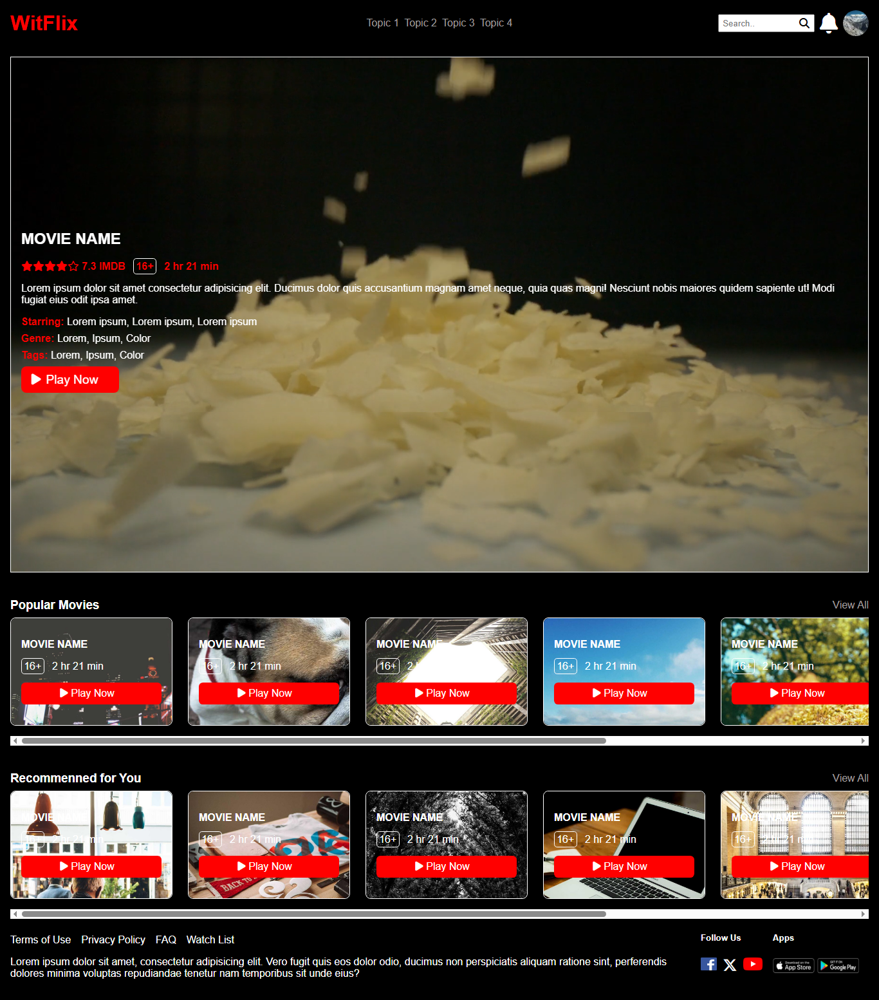

# 🎬 Witflix – HTML & CSS Netflix Clone

Witflix, Netflix’in kullanıcı arayüzünden ilham alınarak sadece **HTML** ve **CSS** kullanılarak geliştirilmiş bir mini arayüz projesidir. Projede temel web geliştirme prensiplerine sadık kalınarak, kullanıcı dostu bir tasarım hedeflenmiştir.

## 🖥️ Demo

Projeyi canlı olarak incelemek için: [https://witflix-dun.vercel.app/](https://witflix-dun.vercel.app/)

## 🚀 Özellikler

- ✅ Statik yapıda geliştirilmiş modern bir arayüz
- ✅ Duyarlı (responsive) tasarım – mobil ve masaüstü uyumlu
- ✅ Hover efektleri ve kullanıcı etkileşimini artıran detaylar
- ✅ Flexbox ve media query kullanımıyla esnek düzen
- ✅ Görsel öğelerle zenginleştirilmiş içerik kartları ve video bölümü

## 🛠️ Kullanılan Teknolojiler

- HTML5
- CSS3
- Font Awesome (ikonlar için)
- Responsive Design (Media Queries)
- Flexbox

## 📂 Proje Yapısı

witflix/
├── index.html
├── index.css
└── assets/
└── (video, görseller, ikonlar vs.)

## 🧠 Öğrenilenler

Bu projeyi geliştirirken:

- Temel HTML yapısı oluşturma
- CSS ile stil verme ve düzen kurma
- Responsive tasarım oluşturma
- Flexbox ile hizalama
- Video yerleştirme
- Icon kullanımı gibi konularda pratik yapıldı

## 📸 Ekran Görüntüsü

